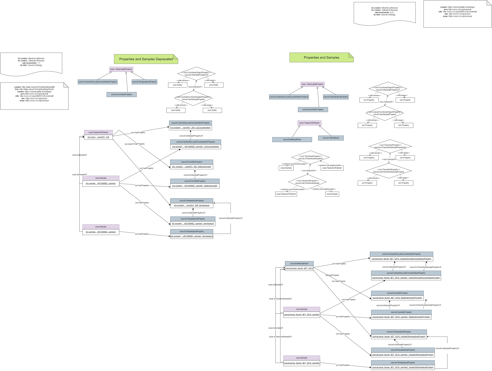

# **Property and Sample**

# Name

Description des propriétés mesurées des échantillons d’une entité d'intérêt.

# Description
Les sondes des capteurs mesurent les Propriétés observables d'Entités d'intérêt appartenant à leur environnement, par exemple une station météo mesure la température de l’air extérieur environnant la station, la quantité de pluie qui tombe au-dessus de la station, …
L’objectif de ce modelet est de spécialiser le modelet Entité d'intérêt [https://docs.google.com/document/d/1nw2aKilhpzSlcQ7q0dZNi84O3tYjru3S/edit#] en décrivant précisément l'échantillon de l’Entité d'intérêt observée ainsi que sa Propriété mesurée par la sonde. La modélisation précise que plusieurs échantillons illustrent une même Entité d'intérêt, et donc que leurs Propriétés de même type (TemperatureProperty, HumidityProperty, …) sont liées par une nouvelle propriété d'objet à définir. En revanche, cette modélisation ne dit pas comment la Propriété de l’Entité d'intérêt est calculée à partir des Propriétés des échantillons.

# Motivating Scenario
## Exemple Batiment

Dans le cas d'usage UC0 du Liris, les sondes mesurent plusieurs propriétés de l’air environnant une sonde : la température, le taux d’humidité ou le taux de CO2. L’échantillon d’air est à l'intérieur d’une salle est localisé autour de l’implantation de la sonde.

## Exemple Agriculture
Dans le cas de UC0 agricole gel, deux sondes mesurent la température de l’air extérieur à deux hauteurs différentes. Ainsi, il y a deux échantillons d’air extérieur observés dans ce cas d’usage représenté par des volumes d’air d’1 m3 situés à des hauteurs différentes.

# Competency Questions 
## Query

| ID | Question en language naturel | Exemple
|---|---|---|
| Q1 |  Quelle Entité d'intérêt est représentée (directement) par l'échantillon observé? | la liste des Entités d'intérêt associées à un échantillon. Exemple:soit les volumes d’air d’1 m3 ayant pour base la position des thermomètres, ces échantillons suivant leur localisation vont être associés aux entités d'intérêt le bureau 429 du bâtiment Espace Fauriel, la pièce 501 329 du bâtiment LIRIS,  l’air extérieur d’une commune ou d’une exploitation. |
| Q2 |Quels sont les échantillons associés (directement) à cette même Entité d'intérêt ? | Soit une pièce comportant plusieurs capteurs, la liste des échantillons associés aux capteurs sont les échantillons de la pièce. Exemple: échantillon E1 est un volume d’1m3 entourant le thermomètre 1023. Ce thermomètre est localisé dans le bureau 429 du bâtiment Fayol. Par conséquent, un des échantillons associés au bureau 429 du bâtiment Fayol est l’échantillon E1. |
| Q3 |Quelles propriétés de l'échantillon existent? | la liste des propriétés déclarées de l’échantillon. Exemple: la température sèche de l’échantillon E1, l’humidité relative de l’échantillon E1,...|
| Q4 |Quelle propriété de l’Entité d'intérêt est représentée par une propriété de son échantillon?  | Soit un échantillon associé à ses propriétés, le résultat est la liste des propriétés déclarées de l’entité d’intérêt associé à l’échantillon.Exemple: la température de l’air extérieur d’une exploitation, la température dans le bureau 429 du bâtiment Espace Fauriel, l’humidité relative de l’air extérieur d’une exploitation ou d’une commune.|
| Q5 |Quelle Entité d'intérêt est représentée (indirectement par transitivité) par l'échantillon observé?| la liste des Entités d'intérêt associées indirectement à l’échantillon E1 du thermomètre 1023 par transitivité. Ce thermomètre est situé dans le bureau 429 au 4ème étage du bâtiment Espace Fauriel. Les entités d'intérêt associées par transitivité à l’échantillon E1 sont le 4ème étage et le bâtiment Espace Fauriel.|
| Q6 |Quels sont les échantillons associés (indirectement par transitivité) à cette même Entité d'intérêt ?| Le bâtiment Espace Fauriel a plusieurs pièces contenant des capteurs. Donc tous les échantillons associés à ces capteurs sont des échantillons du bâtiment Espace Fauriel ainsi que toutes les pièces et les étages du bâtiment.|

## Inference

| ID | Question en language naturel | Exemple
|---|---|---|
| R1 | Il faut  déterminer automatiquement à quelle entité d'intérêt est associé l’échantillon à partir des liens entre leurs propriétés mesurées !| Soit un échantillon E1 localisé autour du thermomètre 3126. On ne sait pas où est le thermomètre. En revanche, on sait que l’échantillon  n’est associé directement qu’à une seule Entité d'intérêt (il est localisé dans une seule pièce). Soit TempE1 la température de l’échantillon E1. Soit TempS429 la température du bureau 429 du bâtiment Espace Fauriel. TempE1 et TempS429 sont liées par une nouvelle propriété objet et il n’existe qu’un seul lien de ce type partant de TempE1. Alors E1 est l’échantillon du bureau 429. De plus, il est localisé spatialement dans le bureau 429. |
| R2 | Il faut déterminer automatiquement le lien entre une propriété et son entité d'intérêt en connaissant la propriété de l’échantillon, l’entité d'intérêt de l’échantillon et le lien entre propriétés ! | Si l’échantillon est associé directement qu’à une seule entité d'intérêt alors
le lien entre une propriété et une entité d'intérêt est unique. Exemple: soit un échantillon E1 localisé autour du thermomètre 3126.  On sait que le thermomètre 3126 est localisé dans le bureau 429 et donc que l'échantillon E1 est l’échantillon du bureau 429. E1 est l’échantillon d’une seule entité (le bureau 429). Soit TempE1 la température de l’échantillon E1. Soit TempI est une température. TempE1 et TempI sont liés par une nouvelle propriété et il n’existe qu’un seul lien de ce type partant de TempE1, Ainsi TempE1 est accessible depuis TempI. Alors TempI doit être la température du bureau 429. |
| R3 |Il ne faut pas automatiquement déduire le lien entre une propriété et son échantillon en connaissant la propriété de l’entité d'intérêt, l’entité d'intérêt de l’échantillon et le lien entre les propriétés ! | Une entité d'intérêt peut avoir plusieurs échantillons d’associés et donc il est impossible de savoir à quel échantillon se rattache une propriété.Exemple: soit un échantillon E1 localisé autour du thermomètre 3126.  soit un échantillon E2 localisé autour du thermomètre 1001. On sait que les thermomètres 3126 et 1001 sont localisés dans le bureau 429 et donc que les échantillons E1 et E2 sont dans le bureau 429 et qu’ils ne peuvent être l’échantillon que d’une seule entité directement. Soit TempEa la température d’un échantillon inconnu. Soit TempEb  la température d’un échantillon inconnu. Soit TempS429 la température de l’air dans le bureau 429. TempEa et TempS429 sont liées par une nouvelle propriété et il n'existe qu’un seul lien de ce type partant de TempEa. Ainsi, TempEa est accessible depuis TempS429.
TempEb et TempS429 sont liées par la nouvelle propriété et il n'existe qu’un seul lien partant de TempEb. Ainsi, TempEb est accessible depuis TempS429. Il n’est pas possible de savoir si TempEa est une propriété de l’échantillon E1 ou E2.|
| R4 |On peut automatiquement déduire qu’une propriété de l’entité d’intérêt dérive d’une propriété d’un de ses échantillons sous condition qu’il n’existe qu’une instance de Propriété d’un type donné pour l’échantillon et l’entité d'intérêt! | Il est possible de dériver le lien entre une propriété de l’échantillon et une propriété de l’entité d’intérêt  en connaissant la propriété de l’entité, la propriété de l’échantillon et l’entité de l’échantillon à condition que les deux propriétés (de l’échantillon et de l’entité) soient de même type et qu’une condition implique qu'il n’existe qu’une instance de ce type de propriété pour un échantillon ou une entité. 
En effet un échantillon ou une entité ont potentiellement plusieurs propriétés mesurables (TemperatureProperty, HumidityProperty). En revanche, nous recommandons que pour des types définis de Propriété propre à l’application, il n’existe qu’une seule instance de ce type de propriété associé à toute entité et échantillon. Exemple: 
soit un échantillon E1 localisé autour du thermomètre 3126. On sait que le thermomètre 3126 est localisé dans le bureau 429 et donc que l’échantillon E1 est associé au bureau 429 et qu’il n’est associé directement qu’à cette pièce. 
Soit PropE1 une propriété de l’échantillon E1. Soit TempS429 la température de l’air du bureau 429.
Soit HumS429 l’humidité de l’air du bureau 429. Il n’est pas possible de dériver si PropE1 est liée à TempS429 ou à HumS429.  En revanche si PropE1 est de type TemperatureProperty comme TempS429, alors il est possible de déduire que PropE1 est lié à TempS429.|


# Term Glossary
Deux ontologies ont été identifiées SOSA/SSN et SAREF. Nous avons choisi de réutiliser les éléments de l’ontologie SOSA/SSN. SAREF ne contient pas de notion d’échantillon.
## SOSA/SSN
### **Feature Of Interest** 
IRI: http://www.w3.org/ns/sosa/FeatureOfInterest
**étiquette française**: entité d'intérêt
The thing whose property is being estimated or calculated in the course of an Observation to arrive at a Result, or whose property is being manipulated by an Actuator, or which is being sampled or transformed in an act of Sampling.
Example	When measuring the height of a tree, the height is the observed ObservableProperty, 20m may be the Result of the Observation, and the tree is the FeatureOfInterest. A window is a FeatureOfInterest for an automatic window control Actuator.

### **Observable Property** 
IRI: <http://www.w3.org/ns/sosa/ObservableProperty>

**etiquette française:** propriété observable

An observable quality (property, characteristic) of a FeatureOfInterest. Example	The height of a tree, the depth of a water body, or the temperature of a surface are examples of observable properties, while the value of a classic car is not (directly) observable but asserted.
### **Property**
IRI: http://www.w3.org/ns/ssn/Property

**étiquette française:** propriété

A quality of an entity. An aspect of an entity that is intrinsic to and cannot exist without the entity.

### **Sample**

IRI: http://www.w3.org/ns/sosa/Sample

étiquette française: échantillon, fragment, portion
Feature which is intended to be representative of a FeatureOfInterest on which Observations may be made.
Comment: Samples are typically subsets or extracts from the feature of interest of an observation. They are used in situations where observations cannot be made directly on the ultimate feature of interest, either because the entire feature cannot be observed, or because it is more convenient to use a proxy. Samples are thus artifacts of an observational strategy, and usually have no significant function outside of their role in the observation process. The characteristics of the samples themselves are generally of little interest, except to the manager of a sampling campaign, or sample curator.
A Sample is intended to sample some FeatureOfInterest, so there is an expectation of at least one isSampleOf property. However, in some cases the identity, and even the exact type, of the sampled feature may not be known when observations are made using the sampling features.
Physical samples are sometimes known as 'specimens'.
Example: A 'station' is essentially an identifiable locality where a Sensor system or procedure may be deployed and an observation made. In the context of the observation model, it connotes the 'world in the vicinity of the station', so the observed properties relate to the physical medium at the station, and not to any physical artifact such as a mooring, buoy, benchmark, monument, well, etc.
A statistical sample is often designed to be characteristic of an entire population, so that Observations can be made regarding the sample that provide a good estimate of the properties of the population.


# OWL Description

## Diagramme

Lien: [Chowlk diagram online version](https://app.diagrams.net/#G1YLwbnZobNIHKCXJfScjohD-5jGThZfpf)



## Recommendations
- Rappel d’une recommandation sur les propriétés des entités d'intérêt: Les instances de Propriétés d’un type donné (TemperatureProperty, HumidityProperty) doivent être spécifiques et uniques à une instance d’Entité d'intérêt. Par exemple, la propriété observable TempS429 représente la température du bureau 429. Il est interdit d’employer des instances génériques comme “température” qui ne précise pas à quelle entité d'intérêt est associée cette propriété. Dans le cas d’emploi d’instance générique, elle sera associée à pléthore d’entités d’intérêt (température du bureau 429 de Jean-Mi, température de Jean-Mi, température de l’air à Saint Etienne, etc…) et il ne sera plus possible de dériver des informations pertinentes.
De même pour les propriétés des échantillons. Les instances de Propriétés d’un type donné (TemperatureProperty, HumidityProperty) doivent être spécifiques et uniques à une instance d’Echantillon. 
De plus, nous recommandons de toujours associer une Propriété à son Échantillon, car il est impossible de déduire cette relation. (cf CQR3)
En revanche l'ensemble de ces instances de propriétés sont typés par une classe NouveauTypeProperty (TemperatureProperty, HumidityProperty), spécialisant la classe ssn:Property pour faciliter la découverte de ces instances. Il faut qu’il n’existe qu’une instance de la classe NouveauTypeProperty (TemperatureProperty, HumidityProperty), par entité d'intérêt et échantillon donné. Au besoin, il faut spécialiser les classes de ssn:Property jusqu’à remplir cette contrainte (DryTemperatureProperty, RelativeHumidityProperty).
Notre recommandation consiste à poser une contrainte de cardinalité max 1 sur la propriété d'objet ssn:isPropertyOf partant d’une instance de type de Propriété spécifique (ex: TemperatureProperty)  vers une entité d'intérêt ou d’un échantillon .

-  Les installations pouvant évoluer, nous recommandons de toujours représenter l’échantillon associées à une sonde indépendamment de l’entité d'intérêt. En effet, il est facile d’imaginer qu’une pièce (l’entité d'intérêt) va acquérir plusieurs sondes au cours du temps ou supprimer des sondes. Dans chacune des évolutions il faudra définir comment une propriété d’une pièce (la température du bureau 429) est calculée à partir des propriétés des échantillons (les températures des échantillons d’air situés dans le bureau 429). On peut aussi imaginer en temps réel, qu’une sonde peut tomber en panne et qu’il faut adapter le calcul de la température de la pièce en fonction des températures des échantillons disponibles.

-  Normalement, un échantillon peut être l’échantillon de plusieurs Entités d'intérêt. Par exemple, l’échantillon E1 d’un volume d’air de 1 m3 associé à un thermomètre est l’échantillon du bureau 429. Ce bureau est situé au 4ème étage du bâtiment Espace Fauriel. Donc E1 est aussi un échantillon du 4ème étage, et un échantillon du bâtiment Espace Fauriel. 
Dans SOSA/SSN la propriété sosa:isSampleOf est déclarée comme fonctionnelle. Ainsi un échantillon n’est associé qu’à une unique Entité d'intérêt. Cette propriété peut être traduite en est l'échantillon direct de cette Entité d'intérêt.

- Une possibilité est de définir deux nouvelles propriétés objet coswot:isTransitiveSampleOf coswot:hasTransitiveSample pour préciser que l’échantillon E1 est l’échantillon du bureau 429, qui lui même est l’échantillon du 4eme étage. Par transitivité, l’échantillon E1 est aussi un échantillon du 4ème étage et du bâtiment Espace Fauriel.

- Lors de la définition des échantillons, nous recommandons de décrire que cet échantillon est localisé spatialement dans l’entité d'intérêt quand la procédure de mesure de la sonde le nécessite. Par exemple, un échantillon de volume d’air associé à une mesure d’un thermomètre est localisé à l’intérieur d’une pièce. Cet échantillon est un volume d’air d’1m3. L’échantillon peut être construit automatiquement à partir de la position du thermomètre. Le volume d’1m3 a pour base un carré dont la position du thermomètre est le centre.
Suivant les cas d’usage, il est possible d’inférer une relation spatiale entre l’échantillon et l’entité à partir de la propriété objet coswot:isSamplePropertyOf.

## Spécification dans l’ontologie

### SOSA/SSN
- sosa:FeatureOfInterest
- sosa:Sample
- sosa:ObservableProperty
- ssn:Property

### CoSWoT

```
coswot:isTransitiveSampleOf rdf:type owl:ObjectProperty ,                                      owl:TransitiveProperty ;
       <http://schema.org/domainIncludes> sosa:Sample ;
       <http://schema.org/rangeIncludes> sosa:FeatureOfInterest ;
        rdfs:label "is transitive sample of"@en ;
        rdfs:comment "Relation from a Sample to a FeatureOfInterest that it is intended to be representative. The relation is transitive."@en .

```
```
coswot:isSamplePropertyOf rdf:type owl:ObjectProperty, owl:FunctionalProperty ;
  rdfs:domain ssn:Property ;
  rdfs:range ssn:Property ;
  rdfs:label "is sample property of"@en ;
  owl:inverseOf coswot:hasSampleProperty;  
  rdfs:comment "Links the Property of a Sample to the Property of the Feature of Interest it derives from. The Sample’s Property is the measured quality (or characteristic) associated to a part of the Feature of Interest. The Feature Of Interest’s Property is the quality (or characteristic) of the entity that can not be measured entirely. The Sample MUST represent the Feature of Interest. Note that this property is more generic than the prov:wasDerivedFrom property, because the link between the Sample property and the Feature of Interest property exists in the past, the present and the future."@en .
```
```
coswot:isTransitiveSamplePropertyOf rdf:type owl:ObjectProperty ,     owl:TransitiveProperty ;
      rdfs:domain ssn:Property ;
      rdfs:range ssn:Property ;
      rdfs:comment "Relation from  the  Sample's Property  to the Feature of Interest's Property, it derives from. The relation is transitive. The Sample’s Property is the measured quality (or characteristic) associated to a part of the Feature of Interest. The Feature Of Interest’s Property is the quality (or characteristic) of the entity that can not be measured entirely. The Sample MUST represent the Feature of Interest."@en ;
      rdfs:label "is transitive sample property"@en .
```
```
coswot:hasTransitiveSample rdf:type owl:ObjectProperty, owl:TransitiveProperty ;
     owl:inverseOf coswot:isTransitiveSampleOf ;                 
     <http://schema.org/domainIncludes> sosa:FeatureOfInterest ;
     <http://schema.org/rangeIncludes> sosa:Sample ;
     rdfs:comment "Relation From a FeatureOfInterest to the Sample used to represent it. The relation is transitive."@en ;
     rdfs:label "has transitive sample"@en .
```
```
coswot:hasSampleProperty rdf:type owl:ObjectProperty, owl:InverseFunctionalProperty ;
  rdfs:domain ssn:Property ;
  rdfs:range ssn:Property ;
  rdfs:label "has sample property"@en ;
  owl:inverseOf coswot:isSamplePropertyOf ;
  rdfs:comment "Links the Property of a Feature Of Interest to the Property of the Sample. The Feature Of Interest’s Property is the quality (or characteristic) of the entity that can not be measured entirely. The Sample MUST represent the Feature of Interest. Note that this property is more generic than the prov:wasDerivedFrom property, because the link between the Sample property and the Feature of Interest property exists in the past, the present and the future."@en .
```
```
coswot:hasTransitiveSampleProperty rdf:type owl:ObjectProperty, owl:TransitiveProperty ;
       owl:inverseOf coswot:hasTransitiveSampleProperty ;
       rdfs:domain ssn:Property ;
       rdfs:range ssn:Property ;
       rdfs:comment "Relation from a Feature Of Interest's Property to a Sample's Property. The relation is transitive. The Feature Of Interest’s Property is the quality (or characteristic) of the entity that can not be measured entirely. The Sample MUST represent the Feature of Interest."@en ;
       rdfs:label "has transitive sample property"@en .
```